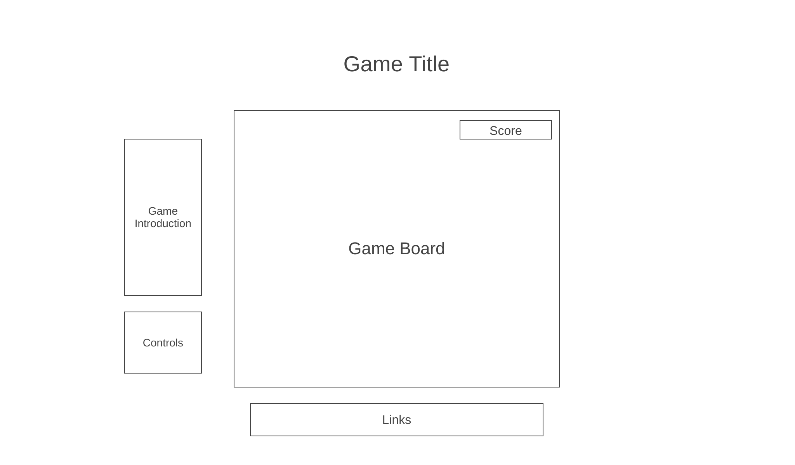

# Little Heist

<h3>Background</h3>
Little Heist is a mini-game which attempts to mimic the style of a coin collection and obstacle avoidance game. The objective is to have the player reach the next level by collecting coins and avoiding the guards. The game ends when the player is caught by the guard. The game is won when the player collects 30 coins. 
<ul>
  <li>Level 1 - 10 coins </li>
  <li>Level 2 - 20 coins</li>
  <li>Level 3 - 30 coins</li>
</ul>

<h3>Functionality & MVPs</h3>
In Little Heist, users will be able to:
<ul>
  <li>Start, pause and restart the game.</li>
  <li>Move character up, down, left and right taking rule set into account.</li>
  <li>Interact with guards will move in  unique patterns automatically.</li>
  <li>Walk through coins and collect them automatically.</li>
  <li>Enter next level by collecting a set amount of coins.</li>
  <li>Move through the map without going through walls through game collision logic.In the event of a collision, the player will remain in place until the direction of movement is changed.</li>
  <li>Collide with the guards which will cause an immediate Game Over.</li>
</ul>
In addition, this projet will include: 
<ul>
  <li>A README document.</li>
  <li>An Introduction document describing the game's rules and objective.</li>
</ul>

<h3>Wireframes</h3>

<ul>
  <li>Game introduction will detail the main objective of the game as well as its rules.  </li>
  <li>Controls will include the Start, Pause and Quit buttons.</li>
  <li>Links will include links to the Github repo as well as my LinkedIn. </li>
  <li>Score will keep track of amount of coins collected.</li>
</ul>

<h3>Technologies, Libraries, APIs</h3>
This project will be implemented with the following technologies:
<ul>
  <li>Canvas API</li>
  <li>Webpack</li>
  <li>Babel</li>
  <li>npm</li>
</ul>

<h3>Implementation Timeline</h3>
<ul>
  <li>Friday-Sunday: Do initial setup for project and verify that all parts are working. Soend time researching and becoming familiar with Canvas and three.js. By weekend's end, be able to render a preliminary version of the board and basic cells.</li>
  <li>Monday: Spend day working on and perfecting functionality of the board and its cells for level 1. Ensuring the correct actions and rendering are taking place.</li>
  <li>Tuesday: Dedicate day to perfecting the logic and rendering of levels 2 and 3. Ensure the game is playable from beginning to end the way it was meant to be.</li>
  <li>Wednesday: Focus on styling and perfecting visuals and animation. Create and test user buttons to start, pause and quit the game.</li>
  <li>Thursday: Host game and ensure all works properly. Dedicate time to any last minute adjustments</li>
</ul>

<h3>Bonus Features</h3>
Possible future updates may include:
<ul>
  <li>Add option for player to chose level of difficulty.</li>
  <li>Increase number of levels to five.</li>
  <li>Create and display a High Scores chart</li>
  <li>Add sounds/ music to follow gameplay.</li>
</ul>
